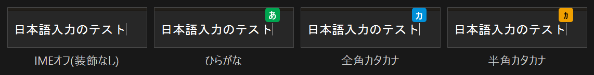
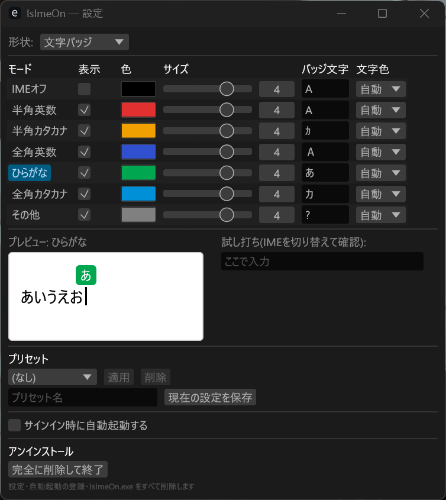

# IsImeOn — IME連動キャレットインジケーター

IME の入力モード(オン/オフ・ひらがな・カタカナ等)に応じて、テキストキャレットの位置に
インジケーター(文字バッジ/しずく/丸)を重ねて表示するトレイ常駐ツールです。
**IMEオフでは何も表示せず素のキャレットのまま**、IMEオンのときだけ装飾が出ます。

Windows の IME とキャレットの挙動を実機調査したうえで、ゼロから実装しています。
OS標準のテキストカーソルインジケーターとは独立して動作し、単一exe・実行時依存なしで常駐します。




## 仕組み

1. フォアグラウンドウィンドウの IME 状態を IMM32
   (`ImmGetDefaultIMEWnd` + `WM_IME_CONTROL` / `IMC_GETOPENSTATUS`・`IMC_GETCONVERSIONMODE`)
   で取得。WinEventフック(フォアグラウンド切替・フォーカス・キャレット移動)で即時反応し、
   取りこぼし対策に既定100ms間隔のポーリングを併用。無操作が10秒続くと500msへ自動バックオフする
2. キャレット位置を `GetGUIThreadInfo`(`hwndCaret` + `rcCaret`)で追跡。
   システムキャレットを使わないアプリ(Chrome・Windows Terminal 等)は UI Automation にフォールバック
   (`TextPattern2.GetCaretRange` → 非対応なら `TextPattern.GetSelection` を末尾に潰して使用)
3. 透明・クリック透過・非アクティブの最前面オーバーレイウィンドウに自前で描画

描画が自前なので、色・サイズ・形状の変更は即時反映されます。管理者権限は不要(HKCUのみ)。
OS標準のテキストカーソルインジケーター(EoAExperiences.exe)には依存せず、
むしろ併用すると二重表示になるため、動作中なら警告を出します。

## 入手とインストール

インストーラはありません。単一の exe を好きな場所に置くだけです。

**winget(推奨):**

```
winget install Hinaser.IsImeOn
```

**手動:** [Releases](https://github.com/Hinaser/is-ime-on/releases) から
`IsImeOn-<version>-win-x64.zip` をダウンロードして展開し、`IsImeOn.exe` を実行。

### SmartScreen の警告について

本ソフトは**コード署名証明書を使っていません**。そのため初回起動時に
「WindowsによってPCが保護されました」という警告が出ることがあります
(「詳細情報」→「実行」で起動できます)。

署名証明書は「誰が配布したか」を示すもので、**中身が安全であることを保証しません**
(署名済みマルウェアは実在します)。本ソフトは代わりに、より検証可能な方法をとっています:

- **ソースが全て公開されている** — このリポジトリがすべてです
- **ビルドがGitHub Actions上で行われる** — 配布物は作者のPCではなく、公開されたワークフローで
  公開されたコミットからビルドされます
- **ビルド来歴(provenance)が署名付きで公開されている** — 配布物が「どのコミットから、
  どのワークフローで」作られたかを暗号的に検証できます:

  ```
  gh attestation verify IsImeOn.exe --repo Hinaser/is-ime-on
  ```

- **SHA256 を各リリースに添付** — `SHA256SUMS.txt` と照合できます:

  ```
  Get-FileHash IsImeOn.exe -Algorithm SHA256
  ```

## 使い方

1. `IsImeOn.exe` を起動(単一exe・インストール不要。Windows側の設定も不要)。
   ウィンドウは出ず、そのままタスクトレイに常駐します。
   トレイアイコンは現在のIMEモードの色の丸になります
2. 設定はトレイアイコンを右クリック →「設定を開く」(またはダブルクリック)。
   モードごとに「表示」・色・サイズ・バッジ文字を編集 — **変更は即時反映・自動保存**。
   「試し打ち」欄でその場で確認できます
3. 設定ウィンドウを閉じても常駐は続きます(GUI分のメモリはここで解放される)。
   終了はトレイアイコンの右クリックメニューから



## 機能

- 7モード(IMEオフ/半角英数/半角カタカナ/全角英数/ひらがな/全角カタカナ/その他)ごとの
  表示ON/OFF・色・サイズ(既定: IMEオフは非表示=素のキャレット)
- 形状の選択: 文字バッジ(既定)/ しずく(OS風・上下)/ 丸
  (キャレット上に角丸四角+文字。バッジ文字はモードごとに1〜2文字を自由に設定 — 例: あ/カ/ｶ/全/A。
  文字色は「自動(背景の明度で白/黒)/ 白 / 黒」。config.json の `LabelColor` に
  "#RRGGBB" を直接書けば任意色も可)
- 表示位置の選択: キャレットの上(既定)/ キャレットの下(macOS 風。形状は上下反転して描画)
- カラーピッカー(色見本ボタンから RGB/HSV・16進で指定)、サイズはスライダー(1〜5)
- UI の日本語/英語切り替え(既定は Windows の表示言語に合わせる。設定画面の「言語 / Language」で変更可)
- オプトインのパフォーマンスログ(`%APPDATA%\IsImeOn\perf.log`。詳細は [PERFORMANCE.md](PERFORMANCE.md))
- 選択中モードの簡易プレビュー+「試し打ち」欄
- Windows標準インジケーターが動作中の場合の二重表示警告と、その場で停止するボタン
- サインイン時の自動起動(HKCU の Run キーに exe の絶対パスを登録)。
  exe を移動した場合は、移動先から一度起動すれば登録先が自動で追随する
- プリセットの保存・適用・削除
- アンインストール(設定・自動起動の登録・exe をまとめて削除。確認あり)
- 設定は `%APPDATA%\IsImeOn\config.json`

## リポジトリ構成

**`src/` — 配布版本体(Rust)。これが製品。**
単一exe(約5MB)・常駐メモリ約7MB・実行時依存なし。

- `src/main.rs` — 常駐プロセス。トレイ・WinEventフック・メッセージループ
- `src/engine.rs` — バックグラウンドのポーリングスレッド(MTA。ハングしたアプリでもUIを止めない)
- `src/ime.rs` / `src/caret.rs` / `src/uia.rs` — IME状態とキャレット位置の取得
- `src/overlay.rs` — Direct2D によるオーバーレイ描画
- `src/shape.rs` — インジケーター形状の幾何計算(オーバーレイとプレビューで共用)
- `src/settings.rs` — egui 設定ウィンドウ(別プロセスで起動し、閉じるとGUI分のメモリを完全解放)
- `src/tray.rs` / `src/sysint.rs` — トレイアイコン、スタートアップ登録・競合検出

## ビルド

配布版(Rust。リポジトリ直下):

```
cargo build --release       # → target\release\IsImeOn.exe(単一exe・依存なし)
cargo test                  # 単体テスト
```

### 実測値(アイドル時)

| 配布サイズ | 常駐メモリ(Private) | アイドルCPU(60秒) |
|---|---|---|
| 約5MB(単一exe・依存なし) | 約7MB | 0.0ms(イベント駆動+バックオフ) |

設定ウィンドウは別プロセスなので、開いている間だけGUI分のメモリを使い、閉じると完全に解放される。
状態別の詳細とバッテリーへの影響・計測の再現手順は [PERFORMANCE.md](PERFORMANCE.md) を参照。

## 既知の制約

表示されない・映らないなどの症状別の対処は [TROUBLESHOOTING.md](TROUBLESHOOTING.md) を参照。

- キャレット位置はシステムキャレット→UI Automation の順で取得する。UIAの TextPattern も
  提供しないアプリでは表示されない(動作確認済み: メモ帳・Firefox・Chrome・Windows Terminal)
- キャレット追従はイベント+ポーリング(既定100ms)のため、高速なカーソル移動ではわずかに遅れることがある
- 管理者権限で動くウィンドウの上にはオーバーレイを描画できない(UIPI の制約)
- IME コンテキストを持たないウィンドウでは「IMEオフ」扱い
- 自動起動は登録時の絶対パスで動くため、exe を移動した直後の初回サインインでは
  起動しないことがある(移動先から一度手動起動すれば以後は追随する)

## アンインストール

設定画面の一番下にある「完全に削除して終了」で、次のすべてを削除して終了します:

- 自動起動の登録(`HKCU\Software\Microsoft\Windows\CurrentVersion\Run` の `IsImeOn`)
- 設定ファイル(`%APPDATA%\IsImeOn`)
- `IsImeOn.exe` 本体(実行中の exe は自分で消せないため、終了直後に削除される)

winget で導入した場合はこのボタンは無効になります。`winget uninstall Hinaser.IsImeOn` を使ってください
(winget の管理下にあるファイルを自前で消すとパッケージ情報と食い違うため)。

手動で消す場合も、上記の3つを削除するだけです。レジストリの他の場所には何も書きません。

## ライセンス

MIT License — 詳細は [LICENSE](LICENSE) を参照。
